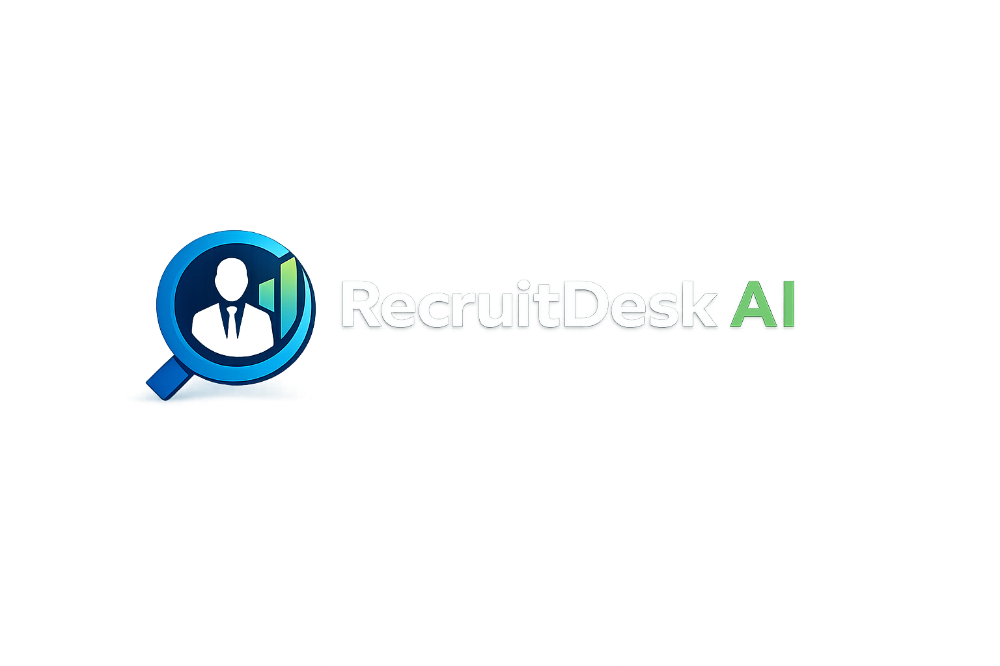

# RecruitDesk AI

**AI-Powered Resume Ranking Web Application**

RecruitDesk AI is a professional MVP application that uses artificial intelligence to rank resumes based on their match with job descriptions. Built with modern web technologies and featuring a stunning cinematic intro animation.



## 🎯 Features

- **Cinematic Landing Animation**: Professional intro with logo glow effects and smooth transitions
- **AI-Powered Ranking**: Uses sentence-transformers (all-MiniLM-L6-v2) for semantic similarity matching
- **Drag & Drop Upload**: Intuitive file upload with support for up to 10 PDF resumes
- **Real-time Analysis**: Fast processing with cosine similarity scoring
- **Beautiful UI**: Dark theme with glassmorphism design and smooth animations
- **Responsive Design**: Works seamlessly on desktop and mobile devices

## 🏗 Tech Stack

### Backend
- **Python 3.11+**
- **FastAPI** - Modern, fast web framework
- **Uvicorn** - ASGI server
- **pdfplumber** - PDF text extraction
- **sentence-transformers** - AI embeddings (all-MiniLM-L6-v2)
- **scikit-learn** - Cosine similarity calculations

### Frontend
- **React 18** - UI framework
- **Vite** - Build tool and dev server
- **Tailwind CSS** - Utility-first styling
- **Framer Motion** - Smooth animations
- **Axios** - HTTP client

## 🚀 Quick Start

### Prerequisites
- Python 3.11 or higher
- Node.js 16 or higher
- npm or yarn

### Backend Setup

1. Navigate to the backend directory:
```bash
cd backend
```

2. Create a virtual environment (recommended):
```bash
python -m venv venv
venv\Scripts\activate  # Windows
# source venv/bin/activate  # macOS/Linux
```

3. Install dependencies:
```bash
pip install -r requirements.txt
```

4. Start the backend server:
```bash
uvicorn main:app --reload
```

The API will be available at `http://localhost:8000`

### Frontend Setup

1. Navigate to the frontend directory:
```bash
cd frontend
```

2. Install dependencies:
```bash
npm install
```

3. Start the development server:
```bash
npm run dev
```

The application will be available at `http://localhost:5173`

## 📖 Usage

1. **Open the application** in your browser at `http://localhost:5173`
2. **Watch the intro animation** featuring the RecruitDesk AI logo
3. **Paste a job description** in the text area
4. **Upload PDF resumes** by dragging and dropping or clicking to browse
5. **Click "Analyze Candidates"** to process the resumes
6. **View ranked results** sorted by match percentage with animated cards

## 🎨 Design Features

- **Color Theme**: Blue (#1E88E5, #0D47A1) and Green (#4CAF50) from the official logo
- **Dark Mode**: Professional dark gradient background
- **Glassmorphism**: Modern frosted glass effect on cards
- **Animations**: Framer Motion powered transitions and effects
- **Typography**: Inter font family for clean, modern text

## 🔌 API Endpoints

### `POST /rank-resumes`
Rank resumes based on job description similarity.

**Request:**
- `job_description` (form field): Job description text
- `resumes` (files): Multiple PDF files (max 10)

**Response:**
```json
{
  "success": true,
  "total_resumes": 3,
  "ranked_resumes": [
    {
      "filename": "resume1.pdf",
      "match_percentage": 87.45
    },
    {
      "filename": "resume2.pdf",
      "match_percentage": 72.31
    }
  ]
}
```

### `GET /health`
Health check endpoint to verify API status.

## ⚡ Performance

- **Lightweight**: Optimized for systems with 4GB RAM
- **Fast Processing**: Model loaded once at startup for quick analysis
- **Efficient**: Automatic cleanup of temporary files
- **Scalable**: Handles up to 10 resumes per request

## 📁 Project Structure

```
recruitdesk-ai/
├── backend/
│   ├── main.py              # FastAPI application
│   ├── requirements.txt     # Python dependencies
│   └── .gitignore
├── frontend/
│   ├── src/
│   │   ├── components/
│   │   │   ├── LandingAnimation.jsx
│   │   │   ├── Dashboard.jsx
│   │   │   └── ResultCard.jsx
│   │   ├── App.jsx
│   │   ├── main.jsx
│   │   └── index.css
│   ├── public/
│   │   └── logo.png
│   ├── index.html
│   ├── package.json
│   ├── tailwind.config.js
│   └── vite.config.js
├── assets/
│   └── logo.png
└── README.md
```

## 🛠 Development

### Backend Development
```bash
cd backend
uvicorn main:app --reload --host 0.0.0.0 --port 8000
```

### Frontend Development
```bash
cd frontend
npm run dev
```

### Build for Production
```bash
cd frontend
npm run build
```

## 📝 Notes

- This is an MVP (Minimum Viable Product) - no database required
- All processing happens locally
- PDF files are temporarily stored during processing and automatically deleted
- The AI model downloads automatically on first run (~80MB)

## 🎬 UX Flow

1. User opens website → Cinematic logo animation plays
2. Animation transitions to dashboard
3. User pastes job description
4. User uploads PDF resumes (drag & drop or click)
5. User clicks "Analyze Candidates"
6. AI processes and ranks resumes
7. Animated results appear, sorted by match percentage

## 🔒 Privacy

- No data is stored permanently
- All processing happens locally on your machine
- Temporary files are automatically deleted after processing

## 📄 License

This project is for demonstration purposes.

---

**Built with ❤️ using AI-powered technologies**
