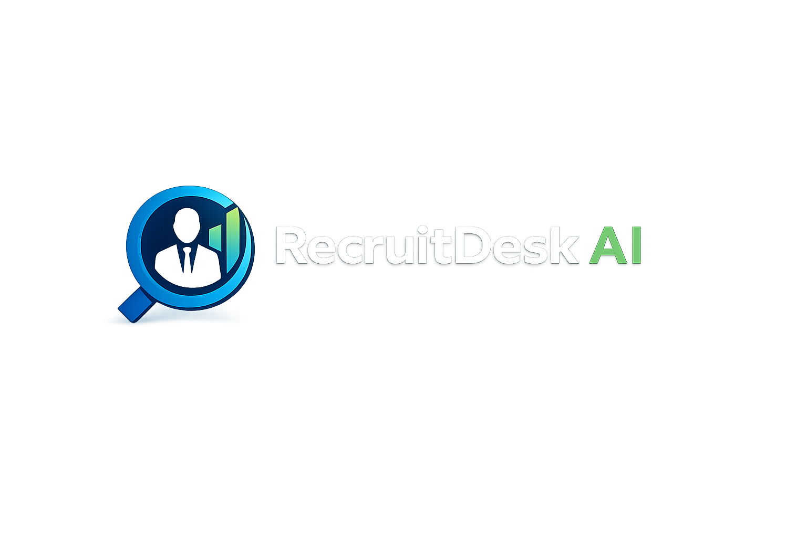

# 🚀 RecruitDesk AI

<div align="center">



**Transform your hiring workflow with state-of-the-art AI Intelligence.**

[](https://www.python.org/downloads/)
[](https://fastapi.tiangolo.com/)
[](https://reactjs.org/)
[](https://vitejs.dev/)
[](LICENSE)

[Features](#-features) • [Tech Stack](#-tech-stack) • [Installation](#-quick-start) • [API Documentation](#-api-endpoints) • [Architecture](#-architecture)

</div>

---

## 🌟 Overview

RecruitDesk AI is a comprehensive, enterprise-grade recruitment intelligence platform. It leverages **Retrieval-Augmented Generation (RAG)**, **Semantic Search**, and **Hybrid Scoring** to bridge the gap between complex job descriptions and thousands of potential candidates. 

Unlike traditional keyword-based filters, RecruitDesk AI understands the *intent* and *context* of a resume, providing recruiters with deep, explainable insights and conversational intelligence.

---

## 🎯 Features

### 🧠 Intelligence Suite
- **Refined JD Analysis Engine**: High-fidelity extraction of "Must-Haves", "Nice-to-Haves", seniority levels, and experience requirements using context-aware spaCy & Regex logic.
- **Hybrid Scoring v2**: A weighted algorithm (Semantic 60% + Skills 40%) that prioritizes candidates based on classified JD priorities. now with support for domain-specific technical keyword weighted extraction.
- **RAG-Powered Chat**: Converse with your resume database with session-aware memory, context drift detection, and automated history summarization.
- **Explainable AI (XAI)**: Not just a score—get detailed reasoning, strength breakdowns, and technical gap analysis for every candidate.
- **Smart Query Rewriting**: Intelligent conversion of shorthand user follow-ups into standalone, filter-aware RAG queries.
- **OCR Fallback Engine**: Automatic detection and vision-aware processing for scanned or image-based PDFs, ensuring near-zero processing failure for non-text resumes.

### ⚡ Performance & Cost Control
- **Dual-Layer Persistent Caching**: 
    - **Pickle-based**: High-performance binary storage for resume/JD embeddings.
    - **JSON-based**: Human-readable, inspectable storage for interview questions.
- **Intelligent Keyword Pre-filtering**: A lightweight overlap check (5% threshold) that flags highly irrelevant resumes before they reach expensive GPU/CPU encoding pipelines.
- **Internal Text Truncation**: Advanced truncation logic (3000 chars for resumes, 800 chars for sections) with whitespace-aware clipping to prevent processing bottlenecks.
- **Aggressive Memory Management**: Context-aware history trimming that summarizes older turns while preserving core intent and recent context.
- **Model Guard System**: Whitelist-based safety check that prevents accidental usage of expensive model variants (e.g., Gemini Pro) in production.
- **Rule-Based Query Rewriting**: Bypasses the LLM for simple follow-up filters, reducing latency by up to 90% for routine drill-downs.

### 💼 Recruiter Workflow
- **Hiring Decision Engine**: Automated evaluation of candidates with composite scores and hiring recommendations.
- **On-Demand Interview Questions**: Tailored questions generated exclusively when requested by the user, with persistent JSON caching to avoid redundant computation.
- **Multi-Format Support**: Robust parsing for both **PDF** and **DOCX** files using high-performance libraries.
- **Batch Processing**: Upload and analyze up to 10 resumes simultaneously with real-time progress updates.

### 🎨 Premium User Experience
- **Glassmorphism UI**: A sleek, modern dashboard built with Tailwind CSS and Framer Motion.
- **Cinematic Animations**: Professional entrance effects and micro-interactions for a premium feel.
- **Health Monitoring**: Real-time status tracking of AI models and backend services.

---

## 🏗 Tech Stack

### Backend (The Brain)
- **FastAPI**: Asynchronous high-performance API framework.
- **Sentence-Transformers**: `all-MiniLM-L6-v2` optimized for high-speed, accurate semantic embeddings with an 80% smaller memory footprint (~80MB).
- **Dual-Mode Recovery**: OCR engine (Pytesseract) + PDF Stream parsing (pdfplumber) for 100% resume ingestion reliability.
- **FAISS**: Facebook AI Similarity Search for lightning-fast vector retrieval.
- **spaCy**: Industrial-strength NLP for entity extraction and technical skill classification (`en_core_web_sm`).
- **Google Gemini / OpenAI**: Integrated for advanced conversational reasoning and RAG intelligence.

### Frontend (The Interface)
- **React 19**: Utilizing the latest concurrent rendering features.
- **Vite**: Ultra-fast build tool and development server.
- **Tailwind CSS**: Modern utility-first styling.
- **Framer Motion**: Production-ready motion library for React.
- **Recharts**: Interactive radar charts for candidate fit visualization.

---

## 🚀 Quick Start

### Prerequisites
- **Python 3.11+**
- **Node.js 18+**
- **Tesseract OCR**: Required for OCR support ([Installation Guide](https://github.com/tesseract-ocr/tesseract))
- **Poppler**: Required for PDF processing ([Installation Guide](https://poppler.freedesktop.org/))
- (Optional) **Google Gemini API Key** for conversational features.

### 1. Clone & Setup
```bash
git clone https://github.com/your-username/RecruitDesk-AI.git
cd RecruitDesk-AI
```

### 2. Backend Installation
```bash
cd backend
python -m venv venv
source venv/bin/activate  # Windows: venv\Scripts\activate
pip install -r requirements.txt
# Models download automatically on first run
uvicorn main:app --reload
```

### 3. Frontend Installation
```bash
cd ../frontend
npm install
npm run dev
```

---

## 🔌 API Endpoints

### `POST /rank-resumes`
Rank uploaded resumes against a job description.
- **Optimization**: Features auto-truncation and keyword pre-filtering for maximum throughput.

### `POST /generate-questions`
Generate or retrieve tailored interview questions for a specific candidate.
- **Body**: `{"resume_text": "...", "job_description": "...", "filename": "..."}`
- **Optimization**: Uses persistent JSON cache.

### `GET /analyze-jd`
Stand-alone endpoint to breakdown a Job Description.
- **Returns**: Classified skills, seniority, experience, and red flags.

### `POST /rag-query`
The core of conversational intelligence.
- **Body**: `{"query": "...", "candidate_id": "optional"}`
- **Feature**: Context-aware follow-up support with history management.

### `POST /hiring-decision`
Produces a final evaluation and summary for candidates.

### `GET /cache-stats`
Monitor LLM response cache health, hits, and misses.

### `GET /memory-stats`
Track conversational memory efficiency and token usage.

### `GET /model-info`
Verify active LLM model and cost-control guardrails.

---

## 📁 Architecture

```
RecruitDesk/
├── backend/
│   ├── rag/                 # RAG Pipeline (Embedder, VectorStore, LLM)
│   ├── jd_analyzer.py       # JD Classification Engine
│   ├── decision_engine.py   # Hiring Evaluation Logic
│   └── main.py              # API Layer
├── frontend/
│   ├── src/
│   │   ├── components/      # Modular UI Components
│   │   └── App.jsx          # Orchestration Layer
│   └── public/              # Static Assets
└── assets/                  # Documentation Branding
```

---

## 📝 Notes & Optimization Details
- **Local-First Processing**: 100% of vector indexing (FAISS) and semantic models run locally, ensuring data privacy and offline capability.
- **Hybrid Performance**: The switch to `all-MiniLM-L6-v2` ensures sub-second ranking for batches of resumes while maintaining high accuracy.
- **OCR Prerequisites**: Ensure `Tesseract` and `Poppler` are in your system PATH for image-based resume processing.
- **Persistent Cache**: Embedding data is stored in `.embed_cache/` (Pickle) and tailored questions in `.questions_cache/` (JSON). Delete these directories to force cache regeneration.

---


